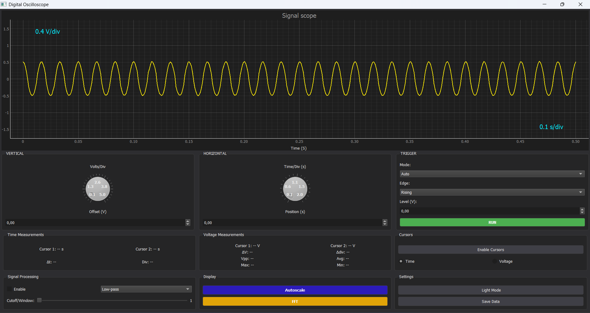

# PolyScope

This project is a complete **digital oscilloscope system** combining embedded signal acquisition and a desktop-based graphical interface. It enables **real-time signal visualization**, **FFT analysis**, and **noise filtering**.

## Overview

- **Microcontroller**: STM32H533RE  
- **Software Tools**: STM32CubeIDE, STM32CubeMX  
- **Interface**: Developed in Python using PyQt5  
- **Signal Conditioning**: Custom circuit to allow reading bipolar signals within [-3.3V, +3.3V]

## Features

### Embedded System
- Configuration of **ADC** for signal acquisition  
- **Serial communication** with PC interface using USART protocol  
- Optimized sampling for accurate waveform capture  
- Integrated FFT computation option  

### Graphical Interface (PyQt5)
- Real-time signal display (oscilloscope-like view)  
- **FFT view** for frequency analysis  
- **Filter options** to reduce noise (low-pass, high-pass, etc.)  
- Interactive interface for zooming, pausing, and saving data  
  


### Signal Conditioning
- Designed a **voltage adaptation circuit** to shift input signals into the STM32 ADC range  
- Handles **non-positive (bipolar) signals** safely in the range **[-3.3V, +3.3V]**

## Mechanical Design (3D Modeling)

- The oscilloscope casing and mechanical components were designed using **SolidWorks** and **Blender**.  
- The design focuses on **ergonomics**, **portability**, and **ease of assembly**.  
- Custom mounts were created for the STM32 board,PCBs and connectors to ensure secure fitting.  
- Ventilation and cable management were considered to optimize cooling and usability.  
- 3D models and assembly drawings are included in the `design/` folder of the repository for reference.

## Hardware Requirements

- STM32H533RE Nucleo Board  
- USB cable for programming and serial communication  
- Signal conditioning circuit (Op-Amps and resistive divider)  
- Oscilloscope and low frequency generator (for testing)

## Software Requirements

- STM32CubeIDE & STM32CubeMX  
- Python 3.x  
- PyQt5  
- PySerial  
- NumPy / SciPy / Matplotlib  

Install dependencies:

```bash
pip install pyqt5 pyserial numpy scipy matplotlib
```
## Contributors
- Hamdane BRINI
- Omar KAMMOUN
- Jamila BEN CHEIKH
- Zakaria M'HEMMED
- Khalil ZRAYER

